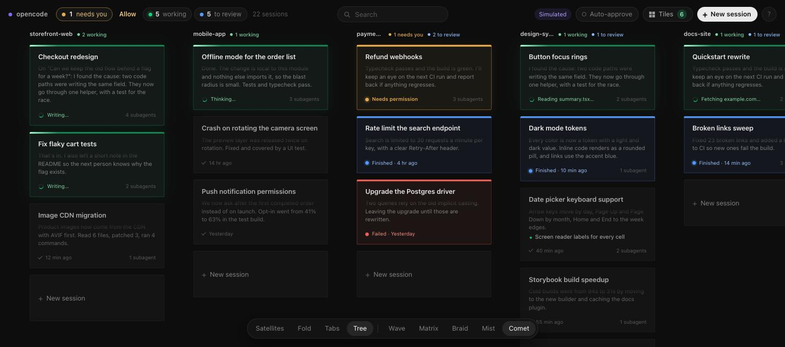
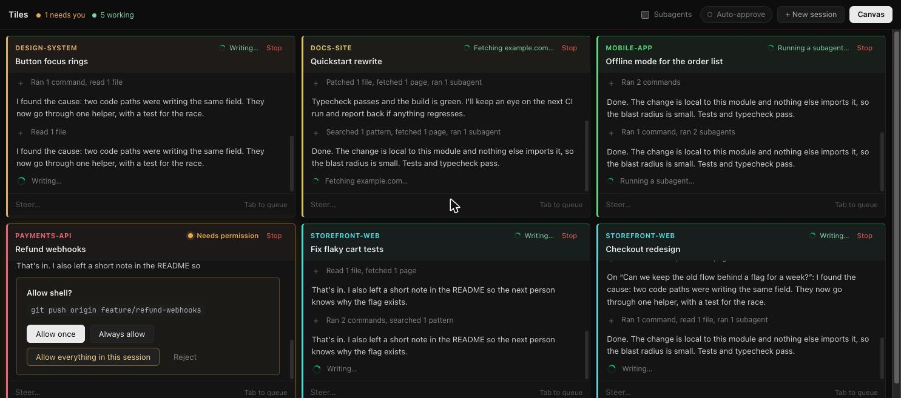
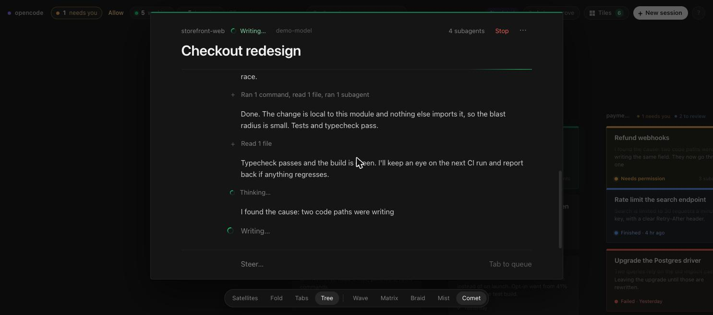
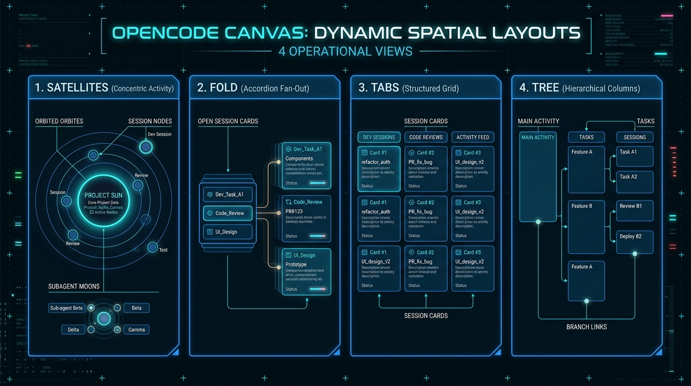
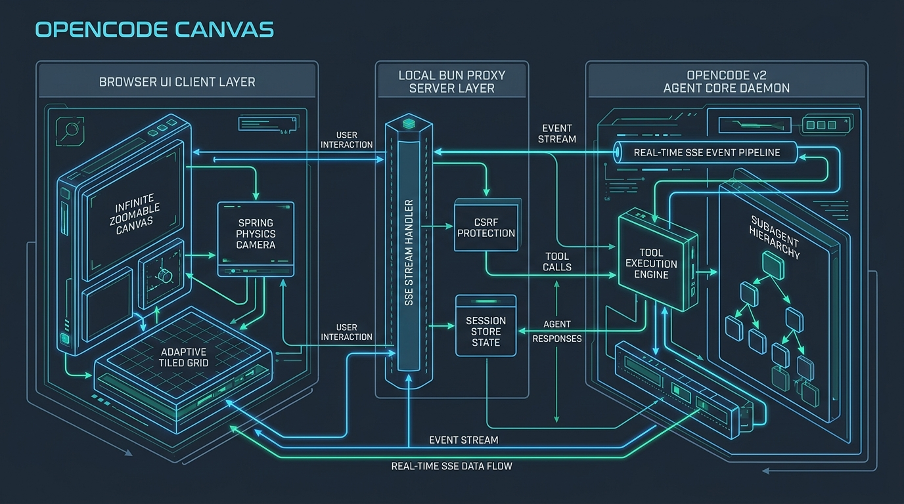

<p align="center">
  
</p>

<p align="center">
  
</p>

<p align="center">
  <strong>Every OpenCode v2 session on one infinite, zoomable canvas, with a live tiled view of running agents.</strong>
</p>

<p align="center">
  <a href="https://github.com/DevvGwardo/opencode-canvas/actions/workflows/ci.yml"></a>
  <a href="LICENSE"></a>
  <a href="https://bun.sh"></a>
  <a href="https://opencode.ai"></a>
</p>

OpenCode Canvas is a local web application that displays every OpenCode v2 coding-agent session on a single infinite, zoomable canvas. It connects directly to your local OpenCode background service, streaming live output, tool calls, and status updates across all active projects. You can inspect transcripts, steer running agents, queue follow-up prompts, respond to permission requests, or monitor every running session side by side in an adaptive tiled view.

<p align="center">
  
  <br />
  <em>The canvas with status: sessions grouped by project with live status accents.</em>
</p>

<p align="center">
  
  <br />
  <em>Tiles: every running session's chat side by side in an adaptive grid.</em>
</p>

<p align="center">
  
  <br />
  <em>An open session streaming live: full transcript with steering and tool folding.</em>
</p>

## Features

### Canvas
- **Infinite pan and zoom**: Pan smoothly by dragging or scrolling; zoom with pinch or Command/Ctrl + scroll. Camera motion includes momentum and elastic boundaries (overshoot tops out at 14% of the screen).
- **Project grouping**: Sessions are arranged as cards grouped by project folder, with active work sorted to the top.
- **Dynamic layouts**: Switch between Satellites, Fold, Tabs, and Tree layouts on the fly.
- **Global search**: Press `/`, `Command+K`, or start typing anywhere to search across titles, project names, loaded previews, and OpenCode server-side session history. Cards reflow with motion blur.
- **Performance**: DOM-based cards inside a single GPU-composited world layer, lazy preview loading for visible cards (4 concurrent requests), and viewport culling.
- **Session creation**: Start new sessions from the global picker (`N`) with path autocompletion and model selection, or use the "+ New session" card at the end of each project.

### Status at a glance

<p align="center">
  
  <br />
  <em>Agent session state & attention lifecycle: clear visual cues from Needs You to Done.</em>
</p>

- **Edge color indicator**: A 3-pixel status line along the top card edge remains visible at all zoom levels, reinforced by border color and background tint.
- **Clear status hierarchy**:
  - **Needs you** (amber): Waiting for a permission prompt or input question; card pulses.
  - **Working** (green): Agent is executing; animated light sweeps the top edge, and the footer shows the active tool.
  - **To review** (blue): Session finished within the last 48 hours and has not yet been viewed.
  - **Failed** (red): Errored sessions show a prominent alert until seen, then settle to a quiet red label.
  - **Stopped** (neutral): Session was manually interrupted.
  - **Done** (dimmed): Completed and viewed; dims so active work stands out.
- **Bi-directional read state**: Uses OpenCode's native `viewed` marker; opening a session in Canvas, the TUI, or the desktop app clears review status across all interfaces.
- **Attention tracking**: Top bar tallies counts for *needs you*, *working*, and *to review* with single-click filters; browser tab title mirrors counts; press `]` and `[` to cycle through sessions requiring attention.

### Tiles
- **Adaptive terminal grid**: Live multi-session view displaying every running or input-blocked session side by side in a screen-fitted layout (`T` or `#tiles`).
- **Live streaming**: Per-tile transcripts display streaming outputs and single-line folded tool executions with color-coded project badges.
- **Integrated controls**: Each tile features an independent composer (`Enter` to steer, `Tab` to queue) and inline permission/question answering.
- **Session lifecycle**: Finished tiles remain marked until viewed or dismissed; hover to pin idle sessions, maximize a tile, or navigate to it on the canvas.
- **Subagent visibility**: Toggle "Subagents" in the Tiles toolbar to observe spawned child agents as individual tiles.

### Sessions
- **In-place inspection**: Click any card or press `Enter` to open its full transcript directly in place on the map.
- **Streaming transcripts**: Renders live thinking deltas, text streams, shell outputs, and tool operations.
- **Turn tool folding**: Summarizes tool calls into a single expandable summary per turn (e.g. "Patched 7 files, ran 12 commands, read 2 files"); click to expand and review individual outputs.
- **Steer and queue**: `Enter` sends immediately and steers a running agent mid-turn; `Tab` queues messages to execute after the current turn completes. Queued messages support "Send now" and "Cancel".
- **Inline interaction**: Authorize permissions, answer questions, and submit forms without switching contexts.
- **Rich input**: Paste or drag-and-drop images directly into the composer.
- **Model switching**: Switch models dynamically across all providers configured in OpenCode; chosen models persist for new sessions.
- **Model effort**: Select the actual effort variants advertised by OpenCode (such as low, high, or max), independently of the model. The selection persists for new sessions.
- **Slash commands**: Discover project-specific OpenCode commands and Canvas controls in both session and tile composers.
- **Draft retention**: Unsent session and tile drafts survive closing and reopening their views. Failed sends restore the message and attachments when the composer is still empty, without overwriting a newer draft.
- **Session controls**: Stop a running agent from the header (or `Command+.`). The `...` menu copies the resume command (`opencode -s <id>`) or session ID, renames the session, toggles auto-approve, and pins it to Tiles.

### Browser and local network
- **Real Chromium browser**: Browse inside Canvas with live viewport streaming, tabs, back/forward, reload, mouse input, keyboard input, and touch scrolling. Sites that reject iframe embedding still work.
- **Host-local previews**: Open `http://localhost:3000` to see an application running on the Canvas host, even when accessing Canvas from a phone or another computer.
- **Phone/desktop layouts**: Switch the remote viewport between narrow and desktop layouts. A new browser starts in phone layout on small screens.
- **Isolated profile**: Chrome runs on demand in a temporary profile, never your personal Chrome profile. Streaming pauses when hidden; the browser closes after five minutes without viewers.
- **Authenticated LAN access**: `--lan` requires a separate Canvas password, prints local-network URLs, and keeps OpenCode credentials on the host.

### Permissions
- **Granular and batch controls**: Authorize individual prompts, set session-wide exemptions, or clear all pending requests at once.
- **Persistent rules**: "Always allow" creates permanent rule entries in OpenCode.
- **Auto-approve mode**: While the canvas is open, grants every permission request as it arrives, with toast feedback. Off by default; turning it on takes a confirming second click.

## Quick start

### Prerequisites
- [Bun](https://bun.sh) ≥ 1.2
- [OpenCode](https://opencode.ai) ≥ 2.0

### Installation

Clone the repository and install dependencies:

```sh
git clone https://github.com/DevvGwardo/opencode-canvas.git
cd opencode-canvas
bun install
```

Link or symlink the executable to your `PATH`:

```sh
ln -s "$PWD/bin/opencode-canvas" ~/.local/bin/opencode-canvas   # or: bun link
```

### Running

Start the server and open the browser:

```sh
opencode-canvas --open
```

The interface opens at `http://127.0.0.1:4317`. If your OpenCode background service is stopped, OpenCode Canvas automatically launches it via `opencode service start` (pass `--no-autostart` to disable).

### Access from your local network

Set a separate Canvas password (at least 12 characters), then enable LAN access:

```sh
printf 'Canvas password (12+ characters): '
read -r -s CANVAS_PASSWORD
printf '\n'
export CANVAS_PASSWORD
opencode-canvas --lan --open
```

Open one of the printed `network` URLs on another device and sign in. OpenCode itself can stay bound to loopback. To use a custom local hostname, add `--allow-host my-computer.local`; repeat the flag for additional names.

Canvas logins expire after 12 hours or a server restart. **Sign out** revokes that login. Setting `CANVAS_PASSWORD` also enables login for loopback-only use.

Authentication is not encryption. Use plain HTTP only on a trusted private network. For untrusted networks or remote access, use HTTPS or a private VPN. Do not port-forward Canvas to the public internet, and do not expose development mode to untrusted clients.

For a trusted HTTPS reverse proxy, keep Canvas on loopback and set `--origin https://canvas.lan`. This allows only that exact browser-facing origin and sets Secure login cookies. Configure the proxy to forward to `http://127.0.0.1:4317` without buffering SSE. Canvas does not trust arbitrary forwarded-host/protocol headers or configure TLS certificates for you.

### Demo mode

Run simulated sessions with synthetic streaming data, without requiring a running OpenCode service:

```sh
opencode-canvas --demo --open
```

You can also append `?demo=1` to the URL at any time.

## Usage

### Keyboard shortcuts

| Key | Action |
|---|---|
| `Scroll` or Drag | Pan the canvas |
| `Pinch` or `Command` / `Ctrl` + Scroll | Zoom the canvas |
| `+` / `-` | Zoom in / Zoom out |
| `0` or Double-click | Fit all sessions in view |
| `Left` `Up` `Right` `Down` | Move selection between cards |
| `Enter` | Open selected card or stack; in session/tile, send or steer |
| `Tab` | In session or tile, queue message for after the turn |
| `Shift` + `Enter` | Insert newline in message input |
| `Esc` | Step back one level, close panel/picker/tiles, or clear filter/search |
| `/` or `Command+K` or type | Focus global search |
| `N` | Open new session picker (preselects focused card's project) |
| `T` | Toggle Tiles view |
| `B` | Toggle the integrated browser (outside a text input) |
| `1` – `4` | Switch layout (`1` Satellites, `2` Fold, `3` Tabs, `4` Tree) |
| `]` / `[` | Jump to next / previous session needing attention |
| `Command+.` | Stop running agent |
| `?` | Toggle keyboard shortcuts overlay |

### Model effort and slash commands

The new-session picker has an effort selector next to the model. Existing sessions have an effort button in the header. Only variants configured for that model appear; **Default effort** leaves the choice to OpenCode. When switching models, Canvas preserves an effort only if the new model supports it. Changes affect subsequent model turns, not an already-running provider request.

Type `/` in either composer, or click its `/` button. Arrow keys select a command; `Tab` completes it. `Enter` completes a partial command or runs a fully typed command. Commands registered by OpenCode are loaded for the session's project and executed through the native command API, with arguments, attachments, and queue/steer delivery preserved.

| Command | Action |
|---|---|
| `/help` | Open the command picker |
| `/model` | Open model selection |
| `/effort` / `/effort high` | Open effort selection or choose a supported variant |
| `/effort default` | Restore OpenCode's configured effort |
| `/compact` | Compact session context using OpenCode's native API |
| `/stop` | Interrupt the current session |
| `/browser` / `/browser http://localhost:3000` | Open the integrated browser, optionally at a URL |
| `/init`, `/review`, custom commands | Execute commands registered in the current project |

Canvas controls take precedence over identically named project commands. TUI-only commands that aren't exposed by OpenCode's command registry or listed above aren't emulated.

### Integrated browser

Install Chrome or Chromium on the machine running Canvas. Canvas discovers common installations automatically; otherwise pass `--browser-bin /absolute/path/to/chromium` or set `CANVAS_BROWSER_BIN`. No browser automation dependency is required.

Open **Browser** from the top bar, session header, or Tiles toolbar. Enter a URL, then click directly on the live page. Use the keyboard or paste text while the viewport is focused. On touch devices, tap a page field and use the bottom **Type** input and **Enter** button. Swipe the viewport to scroll. **Phone layout** / **Desktop layout** changes the remote viewport; **Expand** makes the panel full-size.

There is one shared browser per Canvas server, with up to four viewers. Everyone with Canvas access can see and control its tabs, including any site logins made there. The temporary profile is discarded after five minutes without viewers or when Canvas stops. Downloads are blocked; file uploads, remote clipboard copying, audio, and browser extensions aren't supported. Use `--no-browser` to disable this feature.

### Layouts

<p align="center">
  
  <br />
  <em>The four spatial layout paradigms: Satellites, Fold, Tabs, and Tree.</em>
</p>

Select layouts using keys `1`–`4` or the layout switcher in the dock:

- **Satellites** (`1`): Projects are hubs centered on their latest session, with other sessions orbiting in concentric rings. Sessions with subagents carry a small orbit.
- **Fold** (`2`): Projects collapse into compact stacks. Click a stack to fan out its sessions; press `Esc` to fold it back down.
- **Tabs** (`3`): Projects are displayed as clean blocks organized in three-column grids.
- **Tree** (`4`): Projects are arranged in vertical columns sorted by recent activity, wrapping into additional columns for large projects.

Working sessions across all layouts are marked with customizable dock spinner animations: Wave, Matrix, Braid, Mist, or Comet.

### Tiles view

Open the tiled view with `T`, the top bar button, or by navigating to `#tiles` in your browser URL:

- Displays all running sessions and sessions awaiting input side by side in an auto-fitting grid.
- Each tile displays the project name (color-coded consistently), session title, and live status (such as "Running bun test..." or "Needs permission").
- Transcripts stream in real time with tool calls collapsed into single-line summaries.
- Independent composer per tile: press `Enter` to steer running agents or `Tab` to queue a follow-up message.
- Answer inline permission requests and questions directly within the tile.
- Sessions remain marked as "Finished" until opened or dismissed (×).
- Hover over any tile to pin it (keeps it in the grid when idle), maximize it (or double-click header; `Esc` restores), or open it on the canvas.
- Toggle "Subagents" in the Tiles bar to display child subagents in their own tiles.

### Permissions

Configure execution boundaries according to your trust level:

| Option | Location | Behavior |
|---|---|---|
| Allow once / Always allow / Reject | Prompt dialog | Authorizes or denies a single request. "Always allow" saves an OpenCode rule for that kind of action. |
| Allow everything in this session | Prompt dialog or session `...` menu | Adds an allow-all rule (`* * allow`) to that session on the OpenCode server. Automatically approves waiting and future requests for the session, even when the canvas is closed. Approves subagents while the canvas is open. Can be revoked from the `...` menu. |
| Allow / Allow all N | Top bar (next to "needs you") | Approves all currently waiting permission requests across all sessions in a single click. |
| Auto-approve | Top bar and Tiles bar (click, then click again to confirm) | Grants every permission request across all sessions in real time while the canvas is open (including sessions started in the TUI), and new sessions start with the allow-all rule. Displays approval toasts. |

The new session picker also includes an **Auto-approve** checkbox to initialize new sessions with allow-all rules. Auto-approve permits agents to execute any command and modify any file without prompting.

## Configuration

CLI arguments supported by `opencode-canvas`:

| Flag | Default | Description |
|---|---|---|
| `-p, --port <port>` | `4317` | Port to listen on. Pass `0` to pick a random available port. |
| `--hostname <host>` | `127.0.0.1` | Network interface to bind. Non-loopback bindings require `CANVAS_PASSWORD`. |
| `--lan` | `false` | Bind to `0.0.0.0` for authenticated local-network access. |
| `--allow-host <host>` | Local interface addresses | Allow a custom LAN hostname in addition to loopback and local IPs. Repeatable. |
| `--origin <url>` | Unset | Exact public HTTP(S) origin for a trusted reverse proxy; requires `CANVAS_PASSWORD`. HTTPS enables Secure login cookies. |
| `--browser-bin <path>` | Auto-detected | Absolute Chrome/Chromium executable path; also configurable with `CANVAS_BROWSER_BIN`. |
| `--no-browser` | `false` | Disable the integrated browser. |
| `--server <url>` | Background service | Target OpenCode server URL (e.g. `http://127.0.0.1:4096`). Discovered via `opencode service status` if omitted. |
| `--password <password>` | `service.json` | Server authentication password. Alternatively set `OPENCODE_SERVER_PASSWORD`. |
| `--username <username>` | `opencode` | Server authentication username. Alternatively set `OPENCODE_SERVER_USERNAME`. |
| `--demo` | `false` | Run simulated sessions without connecting to OpenCode. Also enabled by appending `?demo=1` to the URL. |
| `--dev` | `false` | Enable hot-reloading for UI development. |
| `--open` | `false` | Automatically open the canvas in your default browser on startup. |
| `--no-autostart` | `false` | Opt out of automatically starting the OpenCode background service (`opencode service start`) if stopped. |

`CANVAS_PASSWORD` protects Canvas itself and is separate from `OPENCODE_SERVER_PASSWORD`, which authenticates Canvas to OpenCode. Server URLs must use HTTP(S) without embedded credentials.

## How it works

<p align="center">
  
  <br />
  <em>End-to-end architecture: Browser Canvas client, local Bun proxy, and OpenCode v2 daemon.</em>
</p>

```
browser ──/api/*──▶ opencode-canvas (Bun) ──Basic auth──▶ OpenCode v2 service
        ◀──SSE────                        ◀──/api/event──
```

- **Server** (`src/server/`): Locates the service URL with `opencode service status`, loads the password from `~/.config/opencode/service.json`, and reverse-proxies `/api/*` endpoints with Basic authentication attached. The browser never receives the password; model settings, headers, and variant bodies are stripped from model metadata responses. SSE streams without buffering. Failed reads rediscover the service once; writes are never automatically retried because they may already have been accepted. Foreign origins, cross-site requests, and unapproved hosts receive 403. LAN access additionally requires a rate-limited password login with an HttpOnly, SameSite cookie; revoked logins lose access to existing streams.
- **Browser** (`src/server/browser.ts`, `src/app/browser.ts`): Launches sandboxed Chrome/Chromium with a temporary profile and loopback-only debugging. JPEG viewport frames stream over authenticated SSE with frame throttling and backpressure; validated navigation/input actions travel through Canvas, never through an exposed debugging port. Hidden panels stop streaming, and an idle browser is shut down automatically.
- **Store** (`src/app/store.ts`): Loads the most recent 600 sessions, active sessions (`/api/session/active`), and project lists on boot. Tracks real-time updates through `/api/event` (`session.execution.*`, `session.text.delta`, `session.tool.*`, `session.inbox.*`, `permission.*`, `form.*`). Card previews load lazily for visible cards (4 at a time). Full state resynchronizes automatically after reconnecting.
- **Canvas** (`src/app/canvas.ts`, `camera.ts`, `layouts.ts`): Renders DOM cards inside a transformed world layer. Layouts are computed as pure functions, movements follow critically damped springs, off-screen cards are culled, and text re-rasterizes sharply once camera motion settles.
- **Transcript** (`src/app/transcript.ts`): Shared by the open-session panel (`panel.ts`) and every tile (`tiles.ts`). Applies streaming events directly to the transcript (reasoning deltas, text deltas, tool lifecycle phases) and reconciles with `GET /message` after each step.

### OpenCode v2 endpoints used

- `session.list`
- `session.get`
- `session.create`
- `session.update` (title, permissions)
- `session.prompt`
- `session.command`
- `session.compact`
- `session.interrupt`
- `session.switchModel`
- `session.view`
- `session.active`
- `session.message.list`
- `session.inbox.list`
- `session.inbox.update`
- `session.inbox.cancel`
- `session.permission.list`
- `session.permission.reply`
- `session.form.list`
- `session.form.reply`
- `session.form.cancel`
- `project.list`
- `model.list`
- `model.default`
- `command.list` (project-specific slash command discovery)
- `fs.list` (folder autocomplete in the new session picker)
- `event.subscribe`

The complete API specification is available at `GET /openapi.json` on your OpenCode server.

## Security

OpenCode Canvas is a local proxy for your OpenCode server, which has permission to read and write files and execute shell commands on your system.

- Listens on `127.0.0.1` by default. LAN access requires a separate password of at least 12 characters, using `CANVAS_PASSWORD`.
- Server credentials and provider model settings remain on the server. Browser actions and streams require the same Canvas login as the OpenCode API.
- Foreign `Origin`, cross-site `Sec-Fetch-Site`, and unapproved `Host` headers are rejected. Local interface IPs and explicitly allowed hostnames work without removing these checks.
- Plain HTTP does not encrypt passwords, transcripts, or browser frames. Use HTTPS/VPN outside a trusted private network.
- The integrated browser is shared with every authenticated Canvas user, not isolated per user. It uses a temporary profile rather than your personal browser state.
- Auto-approve permissions allow agents to execute commands without user confirmation and require deliberate activation.

For vulnerability reporting guidelines, please refer to [SECURITY.md](SECURITY.md).

## Development

```sh
bun run dev        # Run with hot reload
bun run demo       # Run with simulated sessions
bun test           # Run test suite
bun run typecheck  # Run TypeScript type checker
```

When inspecting the canvas in your browser developer console, `opencodeCanvas.store` and `opencodeCanvas.canvas` are available as live objects on the global scope.

For guidelines on code structure and pull requests, see [CONTRIBUTING.md](CONTRIBUTING.md).

## License

This project is licensed under the [MIT License](LICENSE).

---

OpenCode Canvas is an independent project and is not affiliated with or endorsed by the OpenCode team.
